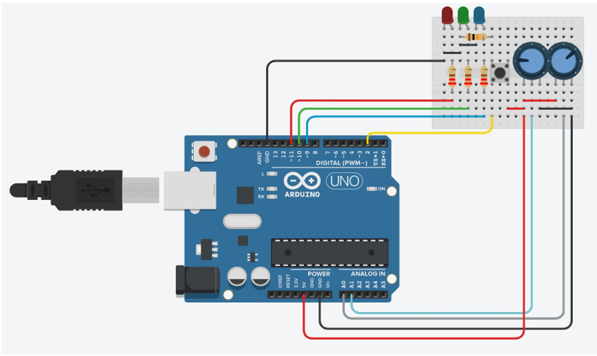

# arduino_joystick_leds
In this Arduino project two modules were used:
An Arduino KY-016 3-color LED and an Arduino KY-023 XY-axis joystick.

The color of the RGB LED is controlled by an XY Joystick (two potentiometers and a button).
The position of the XY-Joysticks is evaluated every 250ms using a timer.

The system can work at two modes:

Mode A:
	The X-axis of the joystick controls the green color intensity using a PWM.
	The Y-axis of the joystick controls the red color intensity using a PWM.
	The blue color intensity is not changed. 
	Finally, the intensities of all three colors are graphically shown on the serial Plotter.
	
Mode B:
	The X-axis of the joystick controls the color intensity of all LEDs using a PWM.
	The Y-axis of the joystick changes the red color intensity using a PWM. The intensities of green and blue colors don't change. 
	Finally, the intensities of all three colors are graphically shown on the serial Plotter.
	
The button on the XY-Joystick is used to switch between Mode A and Mode B. 
This Button is wired to a hardware interrupt.

Layout:

Circuit:

Block-Chart:

